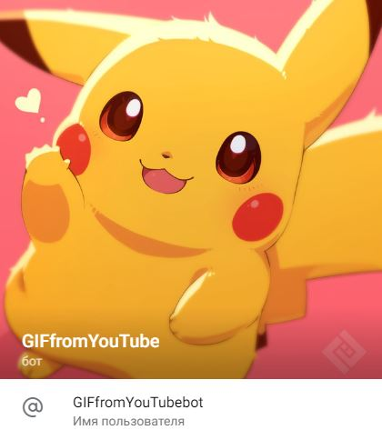
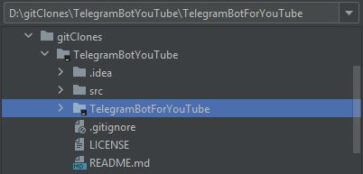
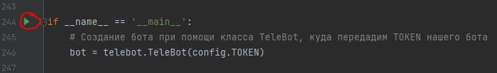
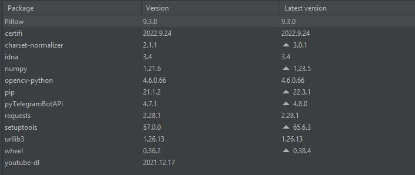
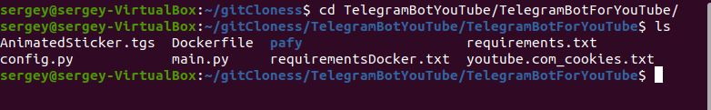
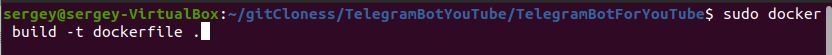
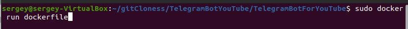
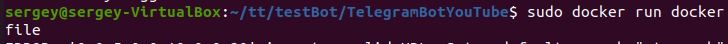

# TelegramBotYouTube

## Описание
Телеграмм бот, который получает ссылку на YouTube (+хотя бы 2 таймстемпа), и возвращает gif-ку.

## Возможности
- **Получение gif-ки после отправления боту ссылки на видео и хотя бы двух валидных таймстепов согласно инструкции** - основной функционал проекта
- **Команда ```/start```** - старт и перезапуска бота, если что-то пошло не так. Будетс сформировано красивое привествие и высвечен список всех доступных команд.
  - Команда НЕ доступна во время формирования gif-ки, бот вышлет вам соответствующее сообщение.
- **Команда ```/help```** - получение информации о доступных боту команд в любой момент времени.
- **Команда ```/lastGIF```** - если вы до этого уже формировали какую-то gif-ку и бот вам ее прислал, то может получить ее еще раз при помощи этой команды. 
  - Если же вы попытаетесь ввести эту команду до ```/start``` или же до получения первой gif-ки в вашем диалоге, то бот сформирует соответствующее сообщение.
- **Команда ```/getInfoAboutVideo```** - получение информации о видео, ссылку на которое вы отправили в последний раз. 
  - Если же вы попытаетесь ввести эту команду до введения ссылки, то получите соответствующее сообщение от бота.
  - Команда доступна в любое время.
- **Команда ```/getInfoAboutYouTuber```** - получение информации о канале, на котором было размещено видео, ссылку на которое вы отправили в последний раз.
  - Если же вы попытаетесь ввести эту команду до введения ссылки, то получите соответствующее сообщение от бота.
  - Команда доступна в любое время.
- **Добавлены интерактивные кнопоки для ответа на вопрос бота** - после отправки ссылки вам будет предложено выбрать ответ на вопрос бота.
  - Если попытаетесь ввести какой-то текст без ответа на вопрос, то получите соответствующее сообщение от бота.
- **Добавлена возможность сформировать gif-ку при помощи новой ссылки** - если вы уже прислали ссылку и ответили на вопрос, но вдруг решили изменить видео, то просто нажмите на появившуюся кнопку ```Хочу ввести новую ссылку```.
- **Проверка правильности ввода** - бот будет контролировать ваш диалог с ним, и если вы введете что-то не так (например, значения таймстепов), то бот вам укажет на ошибку.
- **Ожидание gif-ки** - во время формирования gif-ки вам придется подождать, пока бот вышлет ее вам. В это время при вводе любого текста выполучите соответствующее сообщение от бота, а также вы не сможете воспользоваться командой ```/start```, но все другие команды будут доступны.
- **Валидация команд боту** - бот достаточно умный, поэтому если вы захотите ввести какую-то странную команду с абсолютно любым текстом, то бот подскажет вам, что не знает такой команды и предложит воспользоваться командой ```/help```.

## Запуск проекта
- Для начала требуется склонировать репозиторий:

```git clone https://github.com/sergeyfedorov02/TelegramBotYouTube.git```

- Потом следует выбрать один из видов запуска проекта, которые разобраны в главах ниже.
- После успешного запуска следует перейти в Telegram ```https://web-telegram.ru/```
- Создадим новый чат с нашим ботом, для этого найдите его по имени ```GIFfromYouTubebot```



- Нажимаем на кнопку ```start``` и следуем инструкциям бота. Весь функционал описан в разделе ```Возможности```

### Обычный запуск проекта
Запутите проект в среде PyCharm путем выбора следующей папки (см. рис ниже):



Затем настройте интерпретатор Python, для этого перейдите ```File->Settings->Project:TelegramBotForYouTube->Python Interpreter``` и выполните следующую настройку:


Теперь откройте файл ```main.py``` и на строке 244 запустите бота:



Если при запуске возникли какие-то сбои, то для проверки перейдите в окно подключенных модулей и проверьте их в соответствии со следующим фото:

```File->Settings->Project:TelegramBotForYouTube->Python Interpreter```



### Запуск проекта при помощи Docker
При помощи командной строки перейдите в папку проекта и проверьте наличие всех файлов:
```cd TelegramBotYouTube/TelegramBotForYouTube ```



Теперь создайте образ при помощи следующей команды:
```sudo docker build -t dockerfile```



После создания образа его следует запустить при помощи следующей команды:
```sudo docker run dockerfile```



## Пример запуска проекта при помощи Docker

Для начала в соответствии с гайдом по запуску сделаем клонирование репозитория:



Теперь перейдем в нужную папку и проверим ее содержимое:


Создадим образ:


Запустим созданный образ


Теперь перейдем в Telegram и найдем нашего бота:


Начнем работу:


Вышлем ссылку на видео:


Отвечаем на вопрос:


Проверяем некоторые команды:


Высылаем хотя бы 2 таймстепа:


Ожидаем получения GIF-ки:


Проверяем еще одну команду:


